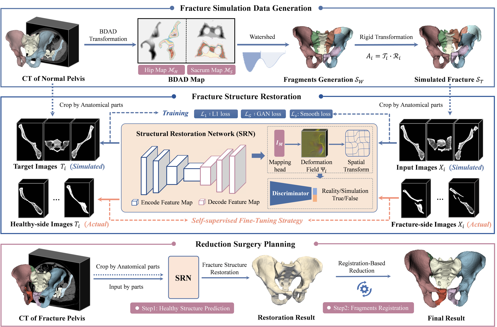
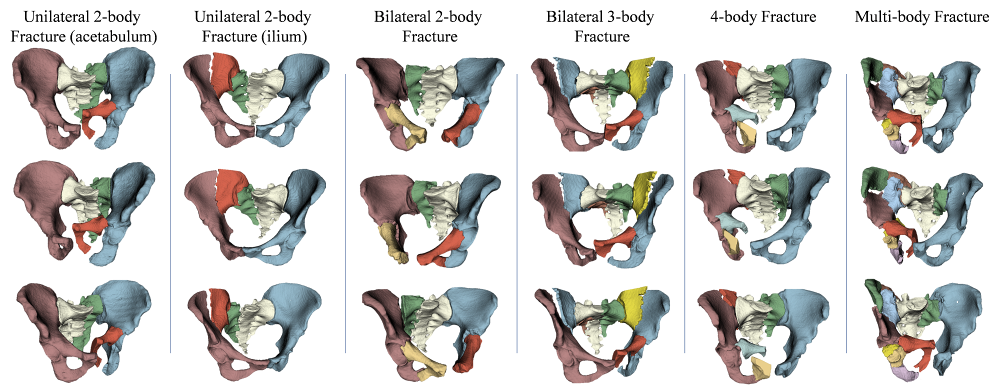
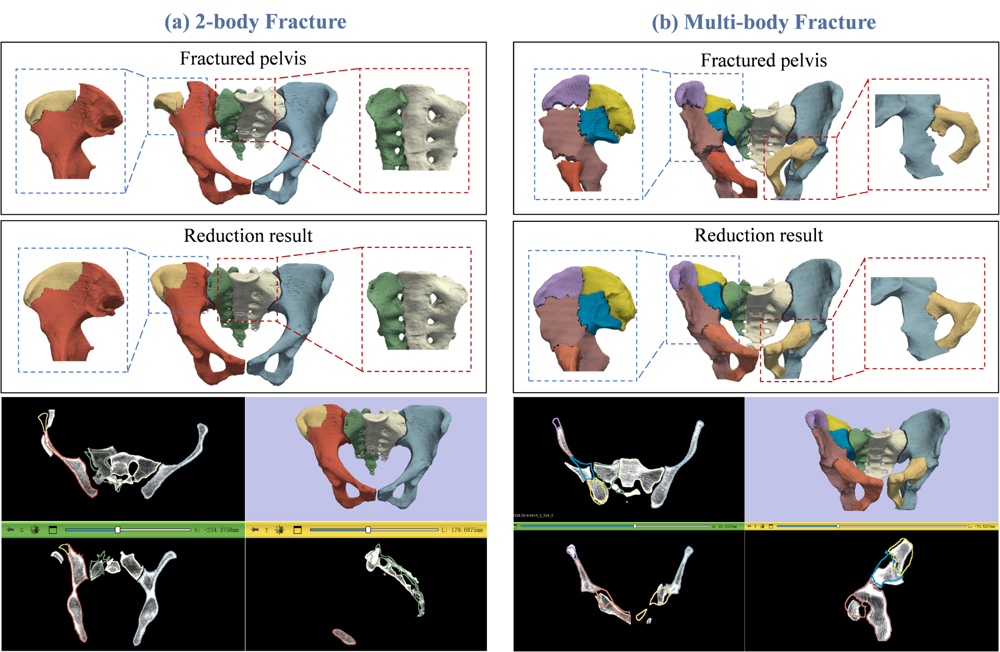

# Pelvic Fracture Planner
**Keywords**: Pelvic fracture, Surgical planning, Fracture simulation, Deformation-based prediction, Generative adversarial network

This is a **PyTorch** implementation of the paper:  [*A bidirectional framework for fracture simulation and deformation-based
restoration prediction in pelvic fracture surgical planning*](https://www.sciencedirect.com/science/article/abs/pii/S1361841524001920)🥤

## Architecture
> 

## Extensible module on 3D Slicer
**Coming soon**😉

## Environment
1. Python >= 3.8  
2. Pytorch >=1.12.0
3. SimpleITK == 2.3.1
4. vtk == 9.2.2

## Example results
**Qualitative results of the simulated pelvic fracture data:**
> 

**Qualitative results of fracture structure restoration and reduction surgical planning:**
> 

 ## Cite
 ~~~
@article{zeng2024bidirectional,
  title={A bidirectional framework for fracture simulation and deformation-based restoration prediction in pelvic fracture surgical planning},
  author={Zeng, Bolun and Wang, Huixiang and Tao, Xingguang and Shi, Haochen and Joskowicz, Leo and Chen, Xiaojun},
  journal={Medical Image Analysis},
  volume={97},
  pages={103267},
  year={2024},
  publisher={Elsevier}
}
 ~~~
